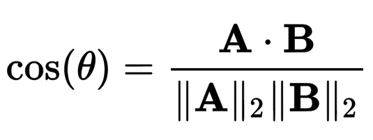

# Design Document

This is a simple plagiarism checker which uses the vector space model of Information Retrieval with tf-idf vectors to represent documents.

## Vector space model
In the vector space model, every document is seen as a set of words and each word in the **vocabulary** is seen as a dimension. We then assign some **weight** to every word present in the document and take that as our vector.

In essense, a document is treated as a vector in a space with
`dimensionality = |Vocabulary|`

Each component of this vector is a specific weight given to that word. The weight we have used is **tf-idf weight**.

Once a document is represented as a vector, we can then compute similarity between documents using cosine as shown below.



## tf-idf weighting
tf-idf stands for Term frequency - Inverse document frequency. This is a statistic used to represent how important a word is to a given document within a corpus.

Term frequency is calculated as `1 + log(tf)`, where tf is the raw word count in a given document.

Inverse document frequency is calculated as `log(N/d)`
where
```
N = Total number of documents in the corpus
d = Number of documents that contain the specific term
```

The intution behind this is that a word is more important (i.e. should be given higher weight) if it occurs more frequently in a document. (**tf**)
However, words that occur frequently over a large number of documents aren't likely to provide much information. (**idf**)

The product of tf and idf is the weight given to each word.

## Implementation specifications

### Preprocessing
This step involves cleaning up the text by performing tokenization, punctuation removal, case folding, stopword removal and stemming.

After this basic processing, the corpus is build as a python list of lists (each inner list containing one document). The vocabulary is identified as the set of unique words in the corpus.
For each word in the corpus, the **idf** value is calculated and stored into a list of length = |vocabulary|. The tf-idf matrix for each document in the corpus is then constructed.

These 4 lists, namely corpus, vocabulary, idf_vector and tf_idf_matrix are stored on disk using `pickle`.

### Plagiarism checks
We have implemented two kinds of plagiarism checks.

1. **Dynamic search**: Given a document, perform a google search using keywords extracted from the document. The scraped results of the search would then act as the corpus. This approach takes more time as it involves fetching data from the internet and preprocessing all that data.

2. **Static search**: Given a text document and a corpus, identify documents in the corpus that are similar to the given document.

In both approaches, once we have identified the target document and the corpus, and performed the preprocessing step, we need to compare the target document vector with every document's vector in the corpus.

For this, we segment the target document and compare each segment with each document in the corpus.
Therefore, the time for retrieval is `O(s*c)`
where
```
s = Number of segments in target document
c = Number of documents in corpus
```

### Graphical User Interface
The GUI home frame consists of options for:

1. Type of search (static or dynamic)
2. Path to target document
3. Path to corpus

On selecting the options and running the script, the user is taken to another frame where the results are displayed. The results are in the form of a bar graph of the **top 10 most similar documents in the corpus** and their scores along with the **extent of plagiarism**.

## Results
We tested on 2 data sets:

1. **Plagiarised Short Answers**: Consists of 95 answers of 200-300 words each along with 5 original answers that were copied.
> Courtesy: Paul Clough (Information Studies) and Mark Stevenson (Computer Science), University of Sheffield.


2. **Scientific papers database**: Consists of 4003 research papers in computer science (converted from .tex to plain text using *detex*).
> Courtesy: KDD Cup 2013

I also tested my design document using the dynamic search feature and got a plagiarism score of 58%!

However, due to limitations put by google, since I only allowed to make a small numer of requests, I am unable to fetch all the documents I want.
